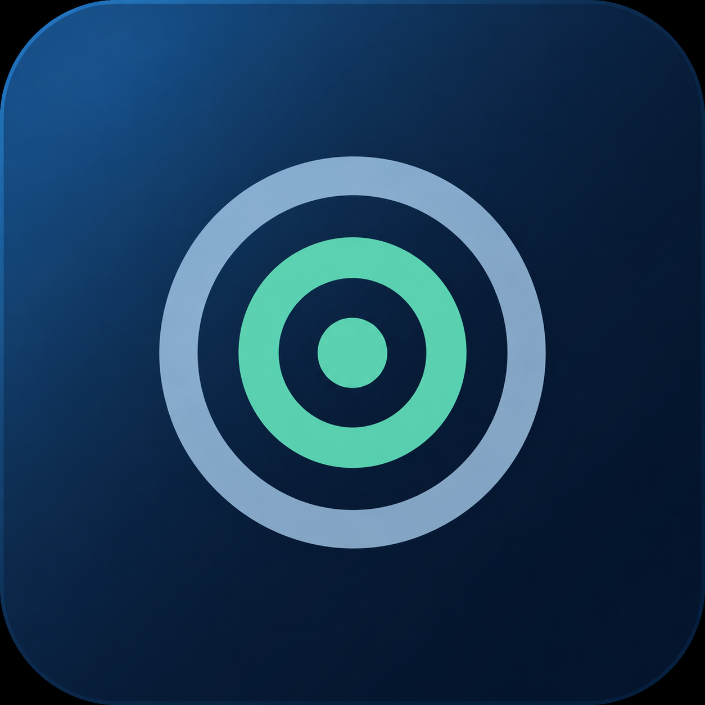
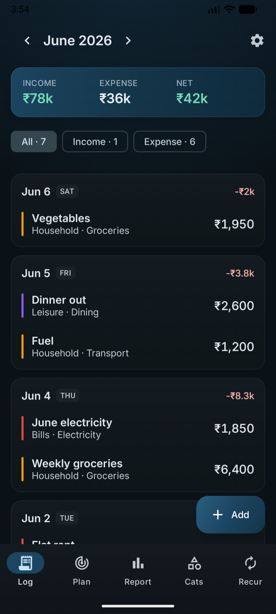
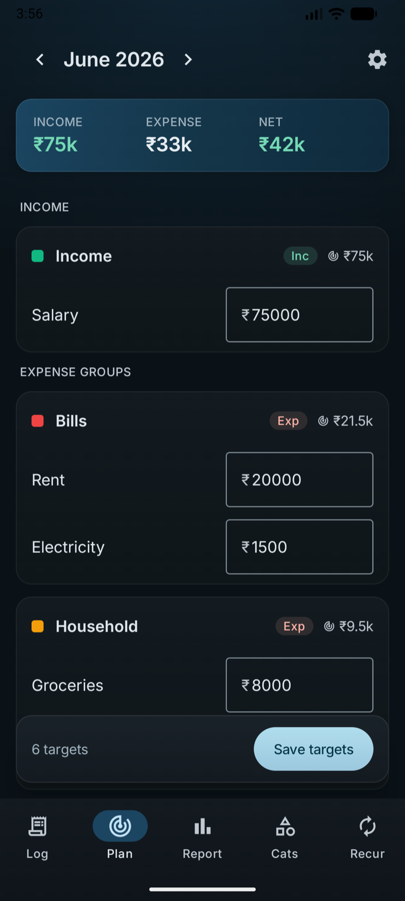
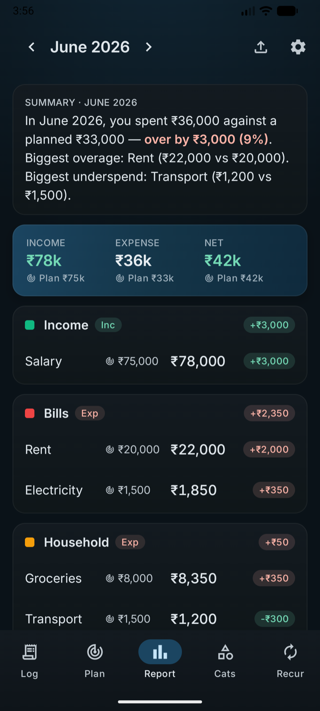
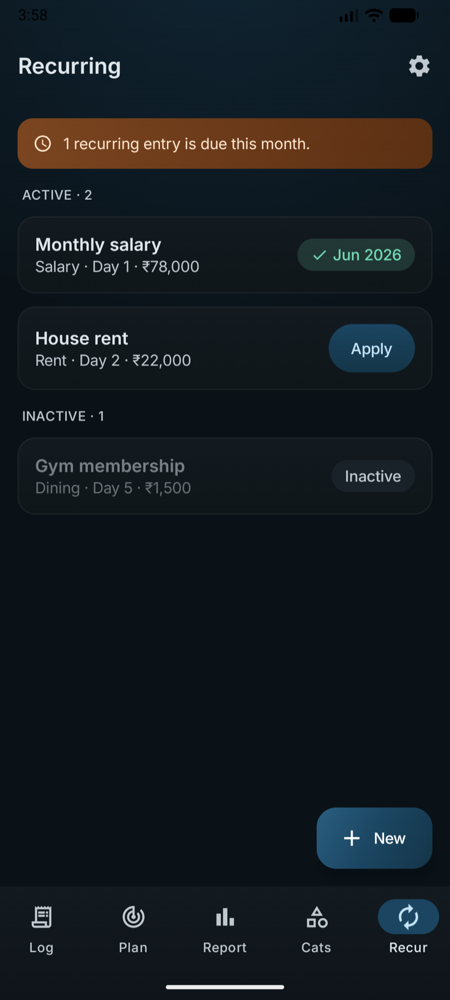

<p align="center">
  
</p>

<h1 align="center">Budget Tracker</h1>

<p align="center">
  <strong>Plan every rupee. Privately.</strong><br />
  An offline-first personal budgeting app for Android — targets, reports, recurring entries and exports, all on your phone.
</p>

<p align="center">
  
  
  
  
</p>

<p align="center">
  
  
  
  
</p>

---

## Why

- **Offline-first & private** — every transaction lives in an on-device database. No account, no servers, no tracking.
- **Plan vs. actual** — set monthly targets and see exactly where reality diverged, color-coded.
- **Built with craft** — a navy Material 3 design system, light & dark, with tabular-numeral money everywhere.

## Features

| # | Feature | What it does |
|---|---------|--------------|
| F1 | **Log** | Add income/expense entries; per-month view with a live Income · Expense · Net band and per-date cards. |
| F2 | **Categories** | Two-level groups → categories, each with a color and income/expense kind; soft-archive and drag-to-reorder. |
| F3 | **Plan** | One target per category per month; bulk save; last month's plan pre-fills the next. |
| F4 | **Report** | Per-group/category target-vs-actual with color-coded deltas, totals, and a plain-language narrative (no AI). |
| F5 | **Recurring** | Monthly templates (salary, rent…) applied with one idempotent tap; active/inactive states. |
| F6 | **Export** | Export a month as a 3-sheet Excel workbook or a PDF report via the Android share sheet. |
| F7 | **Currency & Settings** | A single ISO-4217 currency (with nation flags) that reformats everything; light/dark + density. |
| F8 | **Calculator** | A calculator popover that feeds the parsed value straight into amount fields. |

## Tech stack

Kotlin · Jetpack Compose · Material 3 · Room (KSP) · DataStore · Coroutines/Flow · core-library desugaring (`java.time`).
AGP 9 · Gradle 9.4 · `minSdk 24`, `compile/targetSdk 36`.

## Architecture

Reactive MVVM: **Room DAOs (`Flow`) → repositories → per-screen `ViewModel` (`StateFlow`) → Compose**. Edits reflect immediately; no manual refresh. Pure logic (money, month math, report aggregation, narrative) is framework-free and unit-tested.

```
app/src/main/java/com/example/budgettracker/
  data/      Room entities, DAOs, repositories, seeding, manual DI
  domain/    Pure Kotlin: money, time, report, calculator
  ui/        Theme (navy design system) + screens & ViewModels
  export/    Excel + PDF builders
```

## Getting started

> **No system JDK required** — point `JAVA_HOME` at Android Studio's bundled JBR (21):

```bash
export JAVA_HOME="/Applications/Android Studio.app/Contents/jbr/Contents/Home"

./gradlew installDebug        # build + install on a connected device/emulator
./gradlew assembleDebug       # build the debug APK only
```

## Testing

Pure logic and the Room layer run on the JVM — **no emulator needed** (DAOs use Robolectric).

```bash
./gradlew test                # all JVM unit + Robolectric tests
./gradlew :app:testDebugUnitTest --tests "com.example.budgettracker.domain.money.MoneyTest"
```

CI (`.github/workflows/ci.yml`) runs the unit tests on every PR to `main`.

## Landing page

A marketing site lives in [`landing/`](landing/) (Vite + React + Tailwind), independent of the Gradle build:

```bash
cd landing && npm install && npm run dev
```

## Documentation

- [`PRODUCT_SPEC.md`](PRODUCT_SPEC.md) — authoritative product & data spec (features, Room model, business logic).
- [`docs/design-system/`](docs/design-system/) — visual design reference (foundations, components, screens).
- [`docs/superpowers/`](docs/superpowers/) — design specs & phase-by-phase implementation plans.
- [`CLAUDE.md`](CLAUDE.md) — contributor guide: conventions, invariants, and the git workflow.

## Status

Features **F1–F8 are complete**. Remaining work is deferred scope (auto-apply recurring, app-lock, widgets, charts) — see `PRODUCT_SPEC §13`.
